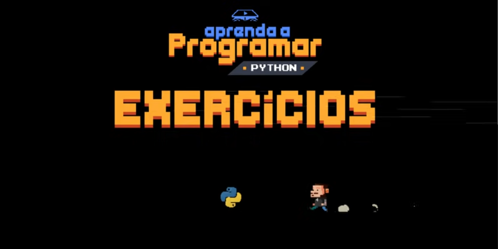

# Curso de Python

[Curso em video](https://youtube.com/playlist?list=PLHz_AreHm4dlKP6QQCekuIPky1CiwmdI6&si=qE1yBpE9hQvrvKZt)

Curso criado pelo Prof. Gustavo Guanabara para o site CursoemVideo.com.

Python é uma linguagem ultra moderna, utilizada pelo Google, YouTube, Industrial Light & Magic, Globo e muitas outras.

Fácil de aprender, com código limpo e organizado, Python vem ganhando cada vez mais espaço, e chegou a sua hora de aprender.
